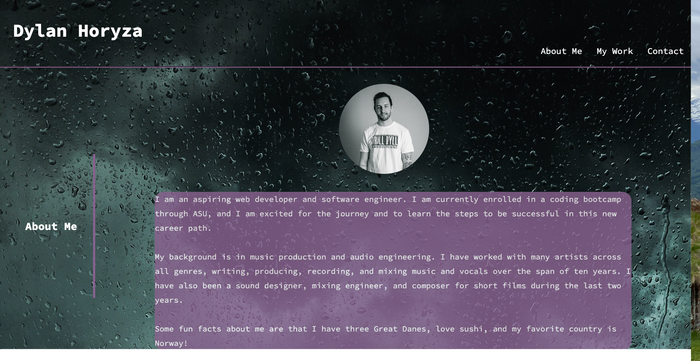
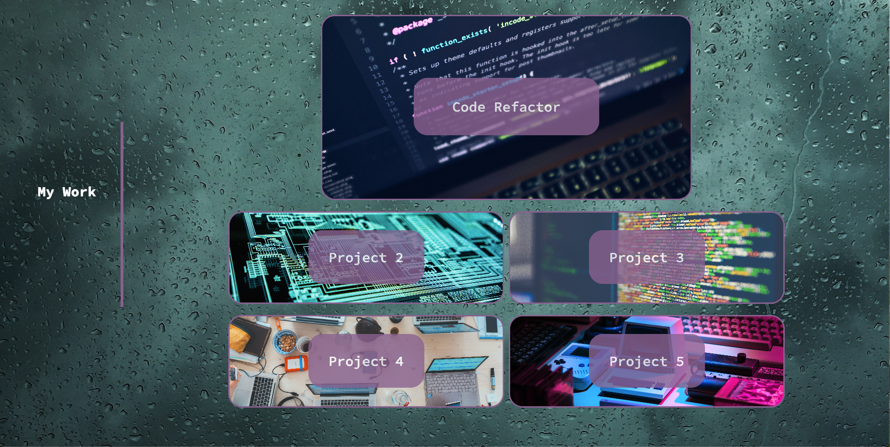
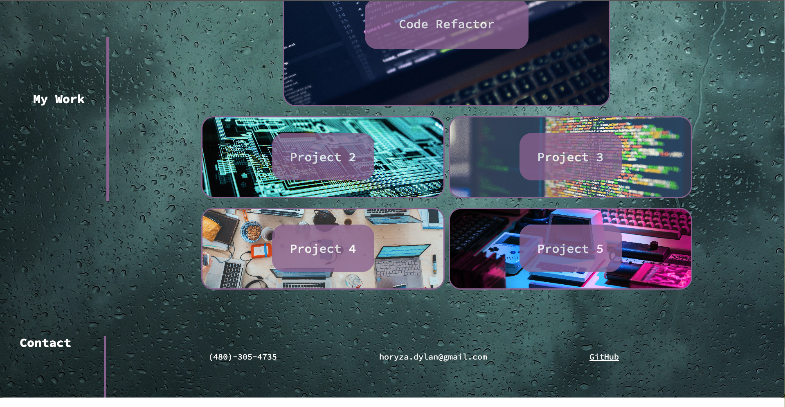

# portfolio-module2
## Description
- My motivation for this project was to become a more attractive candidate for potential employers.
- I build this project to serve as a portfolio where I can showcase my work as a developer.
- It solves the problem of having a place that my work is stored in a creative way.
- I leaarned a lot about CSS styling and how to use media queries effectivly. 
## Installation
- Open the html file in the browser or click on the deployed website link in the repo or README
## Usage
- Below are two screenshots of how the website should look and work.

   

   
   
   

- Deployed link:
https://dylanhoryza.github.io/portfolio-module2/

## Credits
- Mila Hose, my tutor for this project. She helped me with flexbox properties and alignment.

